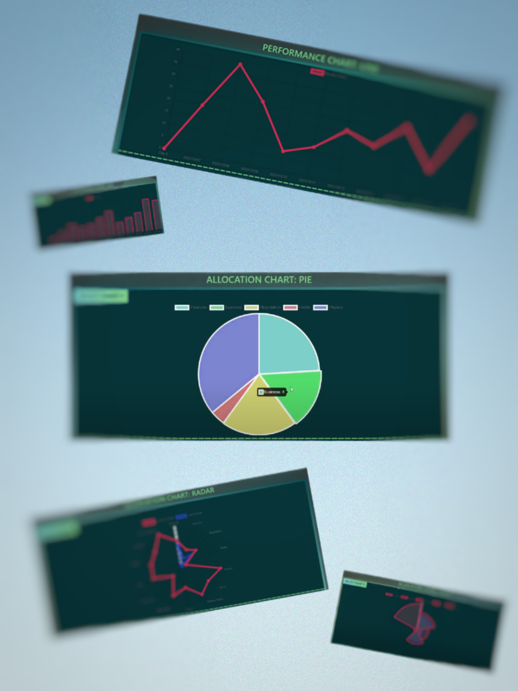
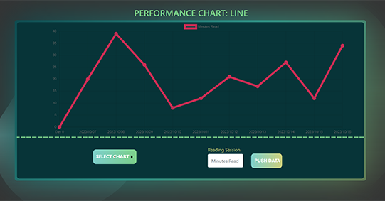
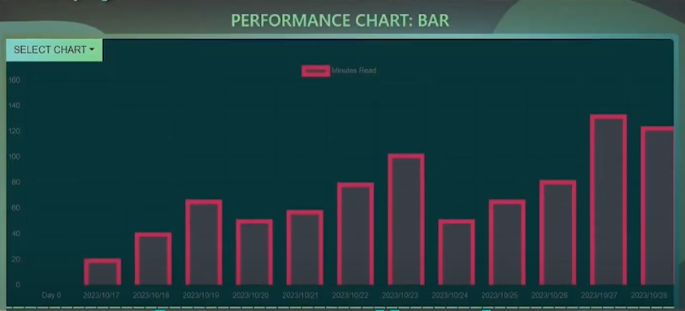
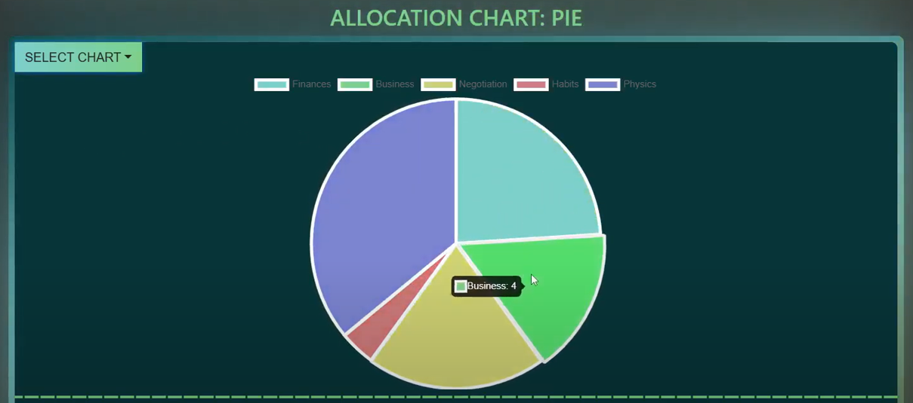
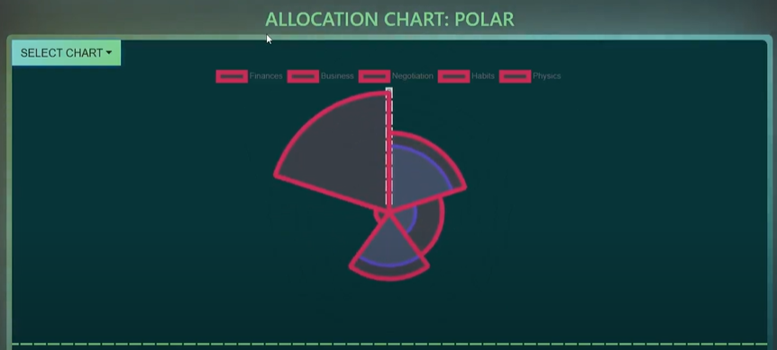
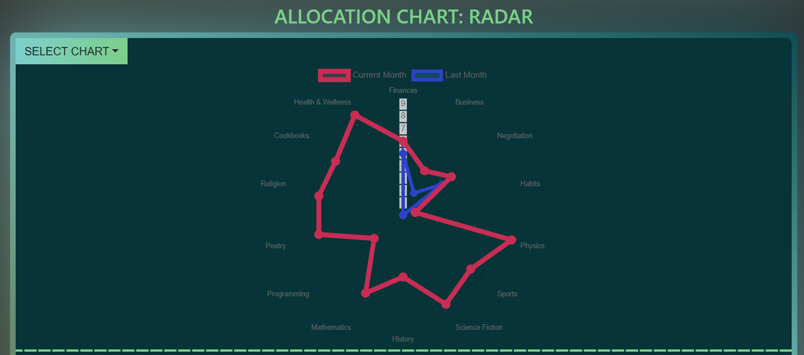

# Bookster - Web Development Project

> A full-stack web application for book management by [Mohamad Khalil](https://github.com/Chef03), [Joel Mattsson](https://github.com/mrjex) and Danyl Churhcil

[](https://vuejs.org/)
[](https://www.mongodb.com/)
[](https://nodejs.org/)
[](https://www.javascript.com/)
[](https://github.com/yourusername/Bookster)


## Table of Contents
- [Bookster - Web Development Project](#bookster---web-development-project)
  - [Table of Contents](#table-of-contents)
  - [Overview](#overview)
  - [✨ Features](#-features)
    - [Book Management](#book-management)
    - [User Features](#user-features)
    - [UI/UX](#uiux)
    - [Chart Visualizations](#chart-visualizations)
      - [Performance Charts](#performance-charts)
      - [Allocation Charts](#allocation-charts)
  - [System Architecture](#system-architecture)
  - [Commercial Demo](#commercial-demo)
  - [Functional Demo](#functional-demo)
  - [Getting Started](#getting-started)

## Overview

## ✨ Features

### Book Management
- Create, read, update, and delete books
- Advanced search and filtering capabilities
- Book categorization and tagging
- Rating and review system

### User Features
- User authentication and authorization
- Personalized bookshelves
- Reading progress tracking
- Social sharing capabilities

### UI/UX
- Responsive design for all devices
- Intuitive navigation
- Modern, clean interface


### Chart Visualizations

In total, 5 charts were implemented:



These charts were divided into two distinct types: *Performance* and *Allocation* charts


#### Performance Charts

This group encompasses two distinct types: *Line* and *Bar* charts






#### Allocation Charts

This group concerns three distinct types: *Pie*, *Polar* and *Radar* charts








## System Architecture

```
Bookster/
├── client/              # Vue.js frontend
│   ├── src/
│   ├── components/
│   └── views/
├── server/              # Node.js backend
│   ├── routes/
│   ├── models/
│   └── controllers/
└── readme-material/              # Project assets
```


## Commercial Demo

[](https://www.youtube.com/watch?v=3EczvSPDzhU)


## Functional Demo

[](https://www.youtube.com/watch?v=6DpyRPPL0jI)


## Getting Started

1. **Prerequisites**
   - Node.js (v16+)
   - MongoDB
   - npm or yarn

2. **Installation**
   ```bash
   # Clone repository
   git clone https://github.com/yourusername/Bookster

   # Run the client
   cd Bookster/client && npm i && npm run serve

   # Run the server
   cd Bookster/server && npm i && npm run dev
   ```


[](https://www.youtube.com/watch?v=5A1JjzypApU)
