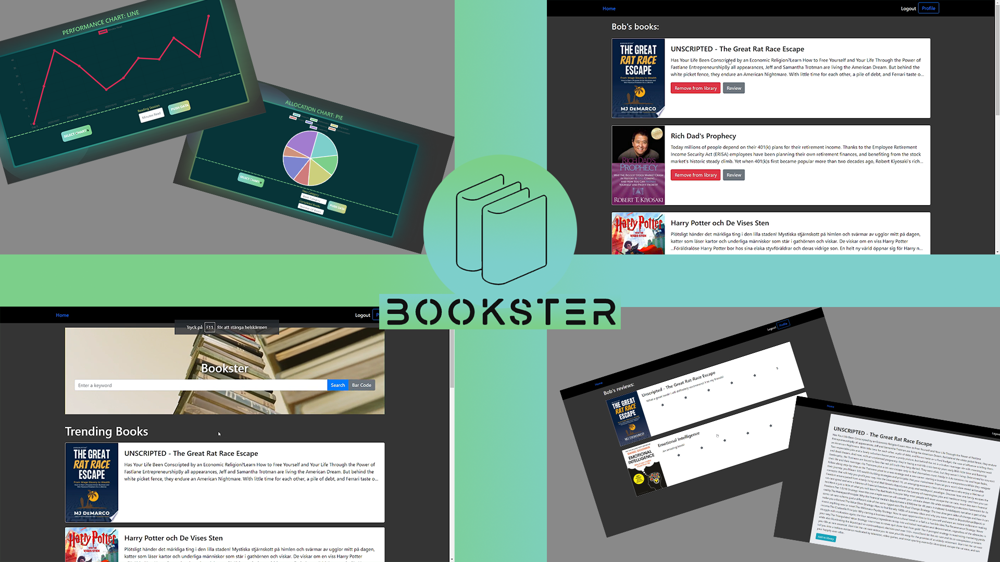

# 🌐 Bookster - Modern Web Development Project

> A full-stack web application for book management built with Vue.js, Node.js, and MongoDB

[](https://vuejs.org/)
[](https://www.mongodb.com/)
[](https://nodejs.org/)
[](https://www.javascript.com/)
[](https://github.com/yourusername/Bookster)

## 📑 Table of Contents
- [🌐 Bookster - Modern Web Development Project](#-bookster---modern-web-development-project)
  - [📑 Table of Contents](#-table-of-contents)
  - [🎯 Overview](#-overview)
  - [✨ Features](#-features)
    - [📚 Book Management](#-book-management)
    - [👤 User Features](#-user-features)
    - [🎨 UI/UX](#-uiux)
  - [🛠 Technology Stack](#-technology-stack)
    - [Frontend](#frontend)
    - [Backend](#backend)
    - [Development Tools](#development-tools)
  - [🏗 System Architecture](#-system-architecture)
  - [📈 Project Milestones](#-project-milestones)
    - [1️⃣ Backend Development (Server API)](#1️⃣-backend-development-server-api)
    - [2️⃣ Frontend Development (Client UI)](#2️⃣-frontend-development-client-ui)
    - [3️⃣ Responsive Design \& Presentation](#3️⃣-responsive-design--presentation)
  - [🎥 Live Demo](#-live-demo)
  - [🚀 Getting Started](#-getting-started)
  - [📚 Documentation](#-documentation)
  - [🔗 Related Projects](#-related-projects)
    - [Previous JavaScript Experience](#previous-javascript-experience)
    - [Documentation-Focused Projects](#documentation-focused-projects)

## 🎯 Overview

Bookster is a comprehensive web application developed during the Web Development course (August - October 2023) in collaboration with two other students. The project demonstrates modern full-stack development practices, implementing a responsive book management system with robust backend APIs and an intuitive frontend interface.



## ✨ Features

### 📚 Book Management
- Create, read, update, and delete books
- Advanced search and filtering capabilities
- Book categorization and tagging
- Rating and review system

### 👤 User Features
- User authentication and authorization
- Personalized bookshelves
- Reading progress tracking
- Social sharing capabilities

### 🎨 UI/UX
- Responsive design for all devices
- Dark/Light theme support
- Intuitive navigation
- Modern, clean interface

## 🛠 Technology Stack

### Frontend
- **Vue.js 3**: Component-based UI development
- **Vuex**: State management
- **Vue Router**: Client-side routing
- **CSS3**: Custom styling with Flexbox/Grid
- **JavaScript (ES6+)**: Modern JS features

### Backend
- **Node.js**: Server runtime
- **Express.js**: Web framework
- **MongoDB**: NoSQL database
- **Mongoose**: ODM for MongoDB
- **REST APIs**: RESTful service architecture

### Development Tools
- **Git**: Version control
- **GitLab CI/CD**: Continuous integration
- **npm**: Package management
- **ESLint**: Code quality
- **Jest**: Unit testing

## 🏗 System Architecture

```
Bookster/
├── client/              # Vue.js frontend
│   ├── src/
│   ├── components/
│   └── views/
├── server/              # Node.js backend
│   ├── routes/
│   ├── models/
│   └── controllers/
├── docs/                # Documentation
└── images/              # Project assets
```

## 📈 Project Milestones

### 1️⃣ Backend Development (Server API)
- Database schema design
- RESTful API implementation
- Authentication middleware
- Data validation
- Unit testing

### 2️⃣ Frontend Development (Client UI)
- Component architecture
- State management
- Route configuration
- API integration
- User interface design

### 3️⃣ Responsive Design & Presentation
- Mobile-first approach
- Cross-browser compatibility
- Performance optimization
- Final testing and debugging
- Project presentation

## 🎥 Live Demo

Watch our comprehensive system demo showcasing all implemented features:

[](https://www.youtube.com/watch?v=3EczvSPDzhU)

## 🚀 Getting Started

1. **Prerequisites**
   - Node.js (v16+)
   - MongoDB
   - npm or yarn

2. **Installation**
   ```bash
   # Clone repository
   git clone https://github.com/yourusername/Bookster

   # Install dependencies
   cd Bookster
   npm install

   # Start development servers
   npm run dev
   ```

3. **Environment Setup**
   ```env
   MONGODB_URI=your_mongodb_uri
   JWT_SECRET=your_jwt_secret
   PORT=3000
   ```

## 📚 Documentation

While our primary focus was on technical implementation, we maintained comprehensive API documentation and user guides:

- [API Documentation](docs/api.md)
- [User Guide](docs/user-guide.md)
- [Development Guide](docs/dev-guide.md)

## 🔗 Related Projects

### Previous JavaScript Experience
- [Youngest Common Ancestor](https://github.com/mrjex/AlgoExpert/tree/main/Executionary%20Code/Graphs/Youngest-Common-Ancestor)
- [Blackjack Probability](https://github.com/mrjex/AlgoExpert/tree/main/Executionary%20Code/Recursion/Blackjack%20Probability)
- [Powerset](https://github.com/mrjex/AlgoExpert/tree/main/Executionary%20Code/Recursion/Powerset)

### Documentation-Focused Projects
- [Global City Streaming](https://github.com/mrjex/Global-City-Streaming)
- [WioPlay](https://github.com/Indomet/WioPlay)
- [Dentanoid](https://github.com/Dentanoid?view_as=public)

---

*Developed with by Mohamad Khalil, Joel Mattsson and Danyil Churchil*